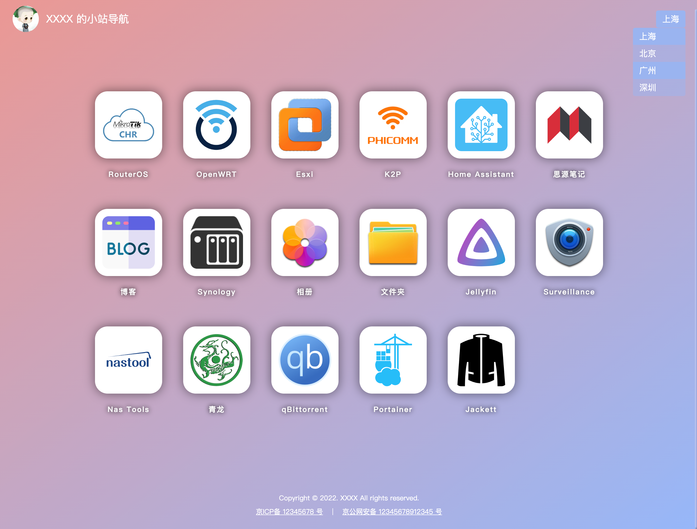
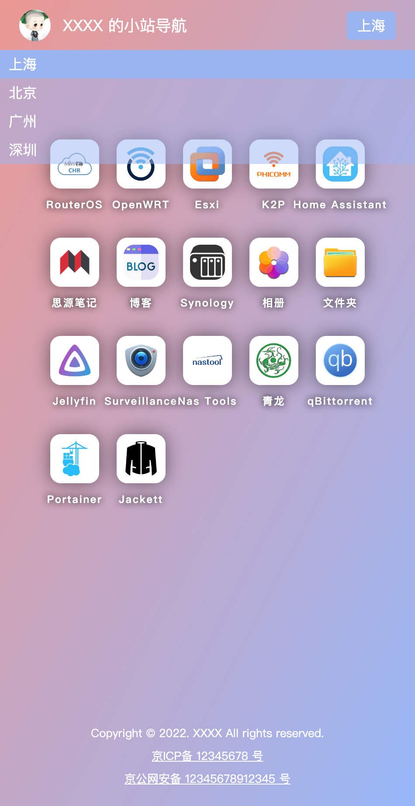

# Navigation website

A static navigation website written in svelte3.

> Note: UI Design are referenced from other sites

## Preview

- Desktop

  

  - Site Switch

    

- H5

  

  - Site Switch

    

## Pre-install

- [Install git](https://git-scm.com/book/en/v2/Getting-Started-Installing-Git)
  
- [Install yarn](https://classic.yarnpkg.com/lang/en/docs/install/#windows-stable)

- Clone the project to local
  
  ```bash
  git clone https://github.com/picopock/navigation_website.git
  ```

- Install dependencies

  ```bash
  yarn
  ```

## Developing

Once you've created a project and installed dependencies with `yarn`, start a development server:

```bash
yarn dev --host

# or start the server and open the app in a new browser tab
yarn dev -- --open
```

## Customizing

Customize your navigation page

- Customize by modify the build product
- Customize by modify the source code

  - Customize website information

    The website information is saved in `src/lib/constants/siteInfo.ts` file

    | Name                  | Desc                                             |
    | :-------------------- | :----------------------------------------------- |
    | `siteName`            | Site name                                        |
    | `siteCopyright`       | Site copyright information                       |
    | `siteICPFiling`       | Site ICP filing information                      |
    | `siteICPFilingURL`    | The link of ICP filing query website             |
    | `sitePoliceFiling`    | Public security filing information of website    |
    | `sitePoliceFilingURL` | The link of Public security filing query website |

  - Customize navigation information

    The navigation information is saved in `src/lib/constants/nav.ts` file

    - Site List Definition

      | Site Item Field | Type   | Desc                                                           |
      | :-------------- | :----- | :------------------------------------------------------------- |
      | `name`          | string | Site name                                                      |
      | `value`         | string | Value of site. It will be use as key field to define site link |

      - Default Site Definition

        - `defaultSiteIndex`
    
          The default site index of site list. Start index is `0`, not `1`. Default value is `0`.

    - Nav List Definition

      | Nav Item Field | Type   | Desc                                                       |
      | :------------- | :----- | :--------------------------------------------------------- |
      | `name`         | string | Navigation item name                                       |
      | `link`         | object | The link of all site defined here                          |
      | `source`       | string | Navigation item logo. support http(s)、image or svg format |

      > Note： if the `source` field is not `http(s)` format, such as `jellyfin.svg`, you will need to put `jellyfin.svg` resource into  `static/navIcons/` folder.

      > Note: if the link of current site is not defined under the `link` field, the nav item will not be show.

    - example

      ```ts
      export const siteList: ISite[] = [
        { name: '上海', value: 'shangHai' },
        { name: '北京', value: 'beiJing' },
        { name: '广州', value: 'guangZhou' },
        { name: '深圳', value: 'shenZhen' },
      ];

      export const navList: INavItem[] = [
        {
          name: 'RouterOS',
          link: {
            shangHai: 'http://10.0.0.1',
            beiJing: 'http://10.1.0.1'
          },
          source: 'routerOS.png'
        },
        {
          name: 'OpenWRT',
          link: {
            shangHai: 'http://10.0.0.2',
            beiJing: 'http://10.1.0.2'
          },
          source: 'openWRT.png'
        },
        {
          name: 'Esxi',
          link: {
            shangHai: 'http://10.0.0.3',
            beiJing: 'http://10.1.0.3',
            guangZhou: 'http://10.2.0.3',
          },
          source: 'esxi.png'
        },
        {
          name: 'K2P',
          link: {
            shangHai: 'http://10.0.0.4',
            beiJing: 'http://10.1.0.4',
            shenZhen: 'http://10.2.0.4',
          },
          source: 'phicomm.png'
        }
      ];
      ```

- Customize Avatar

  - put resource into `static/` folder.

  - rename resource with `avatar.png`.
  
## Building

- Build locally

  To create a production version of your app:

  ```bash
  yarn build
  ```

  You can preview the production build with `yarn preview`.

- [Build with github action](https://github.com/picopock/navigation_website/actions)

## Deploying

- Deploy with static resource server
  
  when you run command `yarn build`, the compile result will be put into `build` folder. Copy all files in the `build` folder to the static resource server.

- Deploy with docker

  - The docker image uses nginx as the static resource server. The nginx configuration file is in `config/nginx/` folder.

    By default, this nginx is in https mode, and the http(80) request will be redirect to https. You need put the certificate file into `config/nginx/cert/` folder and update `nginx.conf` as follow:

    ```conf
    ssl_certificate               /etc/nginx/cert/<cert name>.pem;
    ssl_certificate_key           /etc/nginx/cert/<cert name>.key;
    ```

    > Note: `<cert name>` will be replace with your certificate name.

  - Build docker image based on `Dockerfile`.
  - Pull docker iamge to your machine
  - Run container whit docker command
  
    ```sh
    // eg.
    // Need to be update according to individual circumstances
    docker run -d --restart=always --name navigation_website_<version> -p 8080:80 -p 8443:443 xxxx.com/xxxx/navigation_website:<version>
    ```
