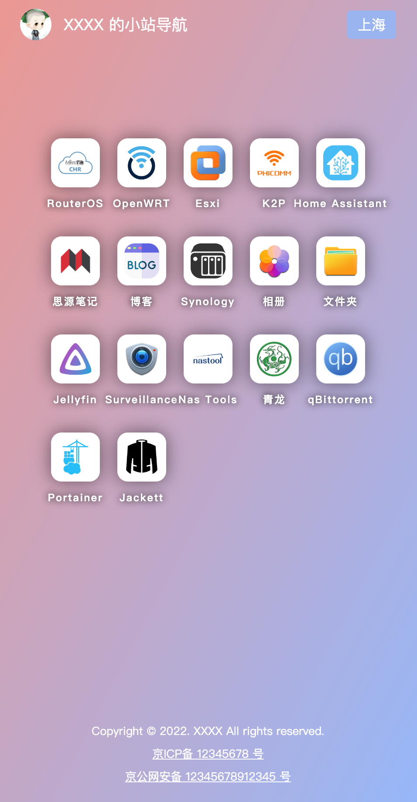

# Navigation website

A static navigation website written in svelte3.

> Note: UI Design are referenced from other sites

## Preview

- Desktop

  

- H5

  

## Pre-install

- [Install git](https://git-scm.com/book/en/v2/Getting-Started-Installing-Git)
  
- [Install yarn](https://classic.yarnpkg.com/lang/en/docs/install/#windows-stable)

- Clone the project to local
  
  ```bash
  git clone https://github.com/picopock/navigation_website.git
  ```

- Install dependencies

  ```bash
  yarn install
  ```

## Developing

Once you've created a project and installed dependencies with `yarn install`, start a development server:

```bash
yarn dev --host

# or start the server and open the app in a new browser tab
yarn dev -- --open
```

## Customizing

Customize your navigation page

- Customize website information

  The website information is saved in `src/lib/constants/siteInfo.ts` file

  | Name                  | Desc                                             |
  | :-------------------- | :----------------------------------------------- |
  | `siteName`            | Site name                                        |
  | `siteCopyright`       | Site copyright information                       |
  | `siteICPFiling`       | Site ICP filing information                      |
  | `siteICPFilingURL`    | The link of ICP filing query website             |
  | `sitePoliceFiling`    | Public security filing information of website    |
  | `sitePoliceFilingURL` | The link of Public security filing query website |

- Customize navigation information

  The navigation information is saved in `src/lib/constants/nav.ts` file

  | Nav item field | Desc                                                       |
  | :------------- | :--------------------------------------------------------- |
  | `name`         | navigation item name                                       |
  | `link`         | the intranet link address of navigation item               |
  | `externalLink` | the extranet link address of navigation item               |
  | `source`       | navigation item logo. support http(s)、image or svg format |

  > Note： if the `source` field is not `http(s)` format, such as `jellyfin.svg`, you will need to put `jellyfin.svg` resource into  `static/navIcons/` folder.

- Customize Avatar

  - put resource into `static/` folder.

  - rename resource with `avatar.png`.

- Customize the text of the internal and external network switch buttons

  The switch buttons text is saved in `src/lib/constants/isIntranet.ts` file

  | field      | Desc          |
  | :--------- | :------------ |
  | `intranet` | intranet text |
  | `extranet` | extranet text |
  
## Building

To create a production version of your app:

```bash
yarn build
```

You can preview the production build with `yarn run preview`.

## Deploying

- Deploy with static resource server
  
  when you run command `yarn build`, the compile result will be put into `build` folder. Copy all files in the `build` folder to the static resource server.

- Deploy with docker

  - The docker image uses nginx as the static resource server. The nginx configuration file is in `config/nginx/` folder.

    By default, this nginx is in https mode, and the http(80) request will be redirect to https. You need put the certificate file into `config/nginx/cert/` folder and update `nginx.conf` as follow:

    ```conf
    ssl_certificate               /etc/nginx/cert/<cert name>.pem;
    ssl_certificate_key           /etc/nginx/cert/<cert name>.key;
    ```

    > Note: `<cert name>` will be replace with your certificate name.

  - Build docker image based on `Dockerfile`.
  - Pull docker iamge to your machine
  - Run container whit docker command
  
    ```sh
    // eg.
    // Need to be update according to individual circumstances
    docker run -d --restart=always --name navigation_website_<version> -p 8080:80 -p 8443:443 xxxx.com/xxxx/navigation_website:<version>
    ```
